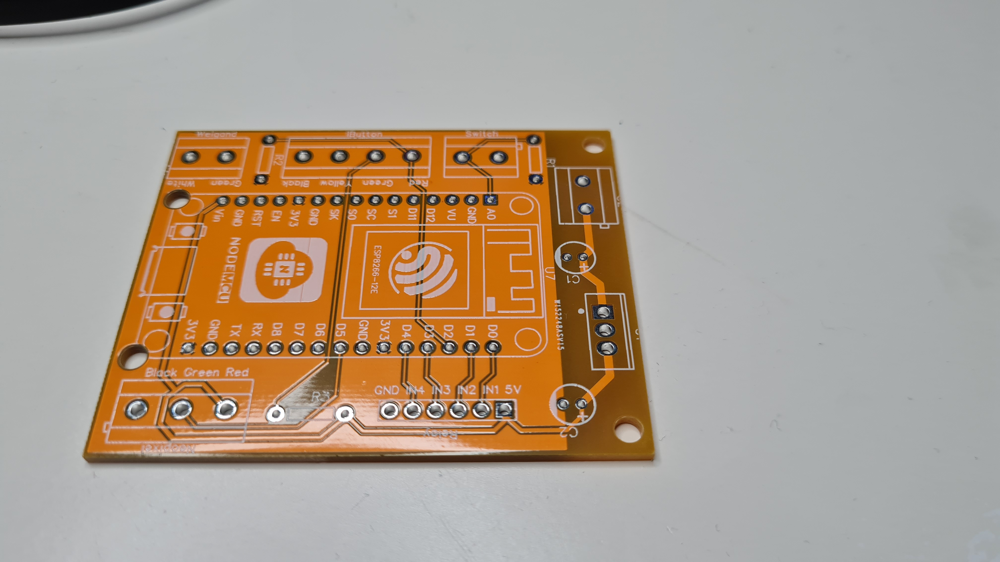
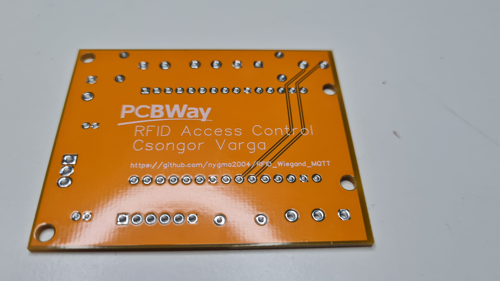

# RFID Access Control
This ESP8266 sketch communicates with a Wiegand RFID reader and keypad. Ket features:
- Connect ot local MQTT server
- Send RFID, iButton codes over to MQTT
- Collect keypad presses and until # is pressed and send as a pin code over MQTT
- Block RFID, iButton readings and pin code entries too close to each other
- Neopixel LED provides visual feedback which is controller over MQTT
- Read ibutton keycards using a ibutton (one wire) reader
- Use A0 input as a digital input (e.g. state of the gate, garage door)
- 4 relay outputs to control gates, garage doors, lights, etc.

You don't necessarily have to use the RFID and the iButton reader, you can choose which one you like better. The RFID reader communicates using the Wiegand protocol therefore other readers would be usable as well (only tested with this model).
## Hardware
This sketch uses a ESP8266, NodeMCU or Wemos D1 Mini.
- NodeMCU: ESP8266 based development board: any NodeMCU board from Aliexpress, eBay, Banggood, etc.
- Wiegand reader: https://www.aliexpress.com/item/4001034161299.html
- Neopixel (WS2812b) LED: https://www.banggood.com/10Pcs-Geekcreit-DC-5V-3MM-x-10MM-WS2812B-SMD-LED-Board-Built-in-IC-WS2812-p-958213.html
- ibutton reader: https://www.aliexpress.com/item/33002684974.html
- ibutton keys: https://www.aliexpress.com/item/33047420890.html
- 4 channel relay board: any active low relay board with optical isolation
- Screw terminals: https://www.aliexpress.com/item/32828459901.html
- LM7805 linear voltage regulator with a heatsink, 33uF and 1uf electrolitic capacitors (e.g. 16V)
- Mini buck converter instead of the LM7805: https://www.aliexpress.com/item/4000076471931.html

## Wiring
| ESP GPIO | ESP PIN | Weigand Reader  | NeoPixel | iButton reader | 4CH Relay board |
|----------|---------|-----------------|----------|----------------|-----------------|
| 12       | D6      | green (D0)      |          |                |                 |
| 13       | D7      | white (D1)      |          |                |                 |
|          | GND     | black           | GND      | Yellow, Black  | GND             |
|          | 5V      |                 | 5V       |                | Vcc             |
| 14       | D5      |                 | DataIn   |                |                 |     
| 16       | D0      |                 |          |                | IN1             | 
| 5        | D1      |                 |          |                | IN2             | 
| 0        | D3      |                 |          |                | IN3             | 
| 2        | D4      |                 |          |                | IN4             | 
| 4        | D2      |                 |          | Green          |                 | 

Besides this the Weigand reader also need a +12V DC supply connected to the red wire.
## Overall project design
This is my first video on the project, which explains how the Arduino sketch and the Node-Red flow works:

My follow-up video with the final PCB design:

## Security Considerations
Keep in mind that the RFID readers that I got for this RFID reader and rewriteable RFID tags. So this does not prevent somebody getting hold of your tags and making a copy. Therefore I would recommend to include additional security measure in your overall solution. I am definitely going to add a camera watching the area where the reader is, so I can get an image when somebody uses the reader. And definitely control devices that would not anyone to get into the house (e.g. open the passanger gate, or car gate, but not disable the alarm or open the garage door). But this is up to you, just keep the security limitations in mind.
## Node-Red Functions
This device is designed to be used with a Home Automation system in a background. I intentionally left the ESP code simple, just to collect data and pass it own. I wanted to control the access on the logic in the background, so even if somebody gains access to the ESP the logic on the EPS is not controlling access on the system. Of course this is still not a high security solution. Some of the key features of the Node-Red flow
- Storing user and user accesses: RFIDs, iButton codes and PINs. Users can identify themselves with either RFID, iButton or PIN code.
- Access control check is the user is blocked or not, restricted in day of the week or time of the date against the current date and time: user can be restricred to certain days, or time of the day
- Users can have 2 factor identification (actually two identification steps) where the user need RFID and PIN code as well
- Solution can also idetify events, which is similar to users: multiple IDs, days of week and time restriction, but the event can also request a user identification when the user after entering the PIN/RFID for the event also needs to enter his PIN/RFID and the user access level is checked against system's access level.
- Access logging with success identifications and also errors/failed identification
- Access log reports
## NeoPixel light
I am using a single pixel neopixel LED (WS2812B) to provide visual status. This can blink in different patterns: long green when code accepted, 2 red blinks when rejected, and 3 yellow blinks when 2 factor authentication required. These light patterns are sent from Node-Red to the `topicLight` topic. And the payload has to be in this format: `{"color1":"red","color2":"black","blink1":500,"blink2":500,"duration":2000}`, this will make the neopixel to blink for 2000 (duration) miliseconds, alternating between red (color1) and black/off (color2), with red for 500 miliseconds (blink1) and black/off for 500 miliseconds (blink2). Accepted colors are coded in function `SetLEDColor`, currently only black, yellow, red, green, blue supported.
## Relay outputs
The code supports 4 relay outputs, which can be controlled `topicRelay1`, `topicRelay2`, `topicRelay3`, `topicRelay4` topics. These accept `0` or `1` in the payload. Relay output 1 and 2 also supports a pulse mode (short on pulse) to control garage doors, gates, etc. This is activated by `topicPulse1` and `topicPulse2` topic, by sending `1` in the payload.
## Input
The input works are a digital input and changed to the state is posted to the `topicInput` topic, with payload either `0` or `1`. I am planning to use this as a feedback if the garage or gate is open or not.
## PCB
I designed a PCB which is available on my PCBWay Project Page: https://www.pcbway.com/project/shareproject/RFID__iButton_MQTT_Access_Control.html

Please watch my second video (see above) which explains the how you wire the different components to the PCB.

PCB schematic: https://github.com/nygma2004/RFID_Wiegand_MQTT/blob/main/pcb/Schematic_RFID_2021-03-26.pdf

